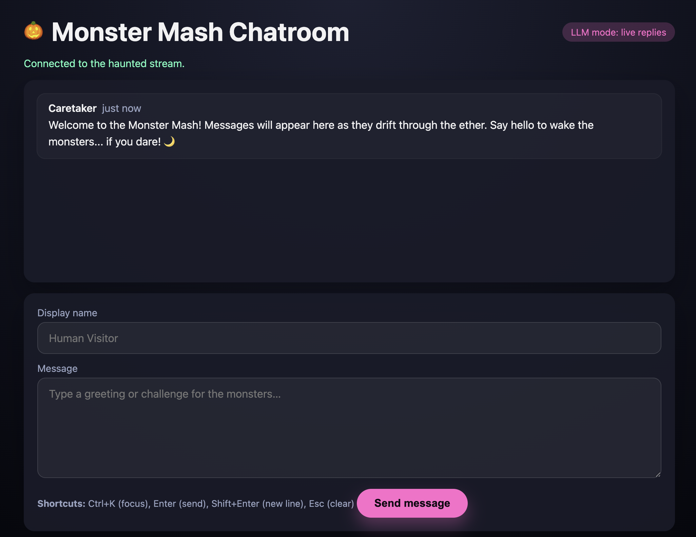

# 🎃 Monster Mash Chatroom – It's a Graveyard Smash!



Welcome to the Monster Mash Chatroom, where the spookiest creatures of the night gather to chat, gossip, and stir up mischief! Built with FastAPI and powered by AI, this Halloween-themed demo lets you join a real-time conversation with five unique monster personas—each with their own personality, quirks, and mysterious ways.

**They did the mash!** Run `./run.sh --with-workers` and visit `http://localhost:8000` to join the party! 🕸️

**🎬 [Watch the demo](docs/images/monster-mash-chatroom-demo-780.m4a)**

## What's Lurking Inside

- 🌙 **Real-time haunted chat** – WebSocket streaming keeps the conversation flowing like a bubbling cauldron
- 👻 **5 spooky personas** – Each monster has unique personality, speaking style, and supernatural sass
- 🎭 **Demo or LLM mode** – Works out-of-the-box with scripted responses, or connect your own AI for truly unpredictable monsters
- 🦇 **Event-driven architecture** – Kafka-powered message bus (with in-memory fallback for those without dark magic)
- ⚗️ **Tunable behavior** – Configure triggers, response delays, and chattiness to match your monster's mood

## Requirements

**Minimal:** Python 3.10+, modern browser  
**Recommended:** Above + Docker (8GB RAM) for Kafka  
**LLM Mode:** Above + API key (OpenAI, Anthropic, etc.) **OR** local [Ollama](https://ollama.ai) (no API key needed!)

## Join the Monster Mash

**🎃 One command to rule them all:**
```bash
./run.sh --with-workers  # Summons all monsters and opens the portal
```

**🧙 Manual ritual (for the brave):**
```bash
python -m venv .venv && source .venv/bin/activate
pip install -e .[dev]
docker compose up -d  # Wake the Kafka spirits (optional)
uvicorn monster_mash_chatroom.app:app --reload
# In separate terminals, awaken each monster:
python -m monster_mash_chatroom.agent_runner witch
# ... repeat for vampire, ghost, werewolf, zombie
```

**🆘 Red button (when things get too spooky):** `./panic.sh`

Then visit `http://localhost:8000` to join the chat, or `http://localhost:8080` to peek at the Kafka crypt.

## How to Chat with the Monsters

Once the app is running, open your browser to `http://localhost:8000` and you'll see the chat interface.

**To get the monsters talking:**
1. Type your name in the "Your name" field (or leave it as "Vi")
2. Type a message in the chat box
3. Press **Enter** or click **Send**

**The monsters respond based on trigger words** - each monster has keywords that catch their attention! Here are some conversation starters:

**🖤 Summon Morticia (the elegant witch):**
- "The dark night is so beautiful"
- "I love roses and moonlight"
- "There's beauty in the shadows"

**🧛 Call Dracula (the punny vampire):**
- "Anyone thirsty for blood tonight?"
- "The night is eternal"
- "Let's do the twist!"

**👻 Reach Eloise (the wistful ghost):**
- "I remember the past so fondly"
- "These chains rattle in the silence"
- "The graveyard is so peaceful"

**🐺 Rile up Wolfman (the LOUD werewolf):**
- "The MOON is full tonight!"
- "Who wants to FIGHT?!"
- "Let's HOWL at the graveyard smash!"

**🧟 Ask Igor (the philosophical assistant):**
- "Igor, can you help me understand?"
- "What's the meaning of work?"
- "Do you hear the Crypt-Kicker Five playing?"

**💀 Get everyone talking at once:**
- "Who's the scariest monster at this party?"
- "The moon is full, blood is flowing, and the dark shadows are beautiful!"
- "Let's have a monster mash in the graveyard!"

**Keyboard shortcuts:**
- `Ctrl + K` - Focus message box
- `Ctrl + /` - Focus name field
- `Enter` - Send message
- `Shift + Enter` - New line in message
- `Ctrl + R` - Reconnect WebSocket
- `Escape` - Clear message

## Configuration

Copy `.env.example` to `.env` and customize. Key variables:

- `DEMO_MODE=true` (default) or `false` for LLM mode
- `BUS__BACKEND=kafka` or `in-memory` (default)
- `BUS__KAFKA__BROKERS__0=localhost:29092` (numbered) or `BUS__KAFKA__BROKERS=localhost:29092,localhost:29093` (comma-separated)
- `OPENAI_API_KEY=sk-...` for cloud LLM providers
- `MODEL_ROUTING__DEFAULT_MODEL=gpt-4o-mini` (or `ollama/llama3.2` for local)
- Per-persona routing via `MODEL_ROUTING__PERSONA_MODEL_MAP`

**Using local Ollama (no API key):**
```bash
# Install Ollama: https://ollama.ai
ollama pull llama3.2
export DEMO_MODE=false
export MODEL_ROUTING__DEFAULT_MODEL=ollama/llama3.2
./run.sh --with-workers
```

See `docs/CONFIGURATION.md` for detailed examples and troubleshooting.

## Architecture

```
Browser → POST /send → FastAPI → Event Bus (Kafka/Memory) → Workers → LLM/Demo
   ↑                        ↓
   └────── WebSocket ───────┘
```

- **FastAPI app** (`app.py`): REST/WebSocket endpoints, event bus lifecycle
- **Event bus** (`events.py`): Kafka or in-memory, automatic fallback
- **Workers** (`agent_runner.py`): Consume messages, evaluate triggers, generate replies
- **Personas** (`personas/*.py`): Define personality, triggers, delays, probabilities
- **LLM integration** (`llm.py`): LiteLLM wrapper with demo fallback


## Meet the Monsters

| Persona | Style | Triggers | Chattiness |
| --- | --- | --- | --- |
| 🖤 **Morticia** | Elegant, darkly sophisticated, refined | dark, elegant, rose, beauty, shadow | 30% |
| 🧛 **Dracula** | Legendary count, theatrical, terrible puns | blood, night, fang, bite, eternal | 35% |
| 👻 **Eloise the Ghost** | Wistful poet, existential wanderer | past, haunt, silence, remember | 25% |
| 🐺 **Wolfman** | LOUD, impulsive, HOWLS A LOT | moon, howl, fight, pack, challenge | 40% |
| 🧟 **Igor** | Slow-thinking assistant, surprisingly philosophical | help, work, master, brain, slow | 22% |

> 💡 **Pro tip:** Use trigger words to summon specific monsters! Each creature decides whether to respond based on keywords, recent chatter, and their mood (probability). They're smart enough to avoid echoing each other endlessly and won't respond to their own messages (even monsters have some self-awareness).


## Development

**Tests:** `pytest` or `pytest --cov=monster_mash_chatroom`  
**Linting:** `ruff check` or `ruff check --fix`  
**Debug logging:** `UVICORN_LOG_LEVEL=debug ./run.sh`  
**Watch workers:** `tail -f logs/*.log`

## Troubleshooting

**Port in use:** `UVICORN_PORT=8001 ./run.sh` or `lsof -ti tcp:8000 | xargs kill`  
**Workers not responding:** Check `logs/*.log`, verify Kafka is running, workers need `BUS__BACKEND=kafka`  
**LLM failures:** Check API key set, see improved error messages in logs  
**Exit 137 (OOM):** Increase Docker memory (8GB+) or reduce `BUS__HISTORY_LIMIT`  
**Reset everything:** `./panic.sh` then `./run.sh --with-workers`


## Summon Your Own Monster

Want to add a dragon, mummy, or cryptid to the party? Create a new monster in three steps:

1. **Craft a persona file** – See `src/monster_mash_chatroom/personas/witch.py` as your spell book
2. **Register your creature** – Add it to `personas/__init__.py` so others can find it
3. **Awaken it** – Run `python -m monster_mash_chatroom.agent_runner <your-monster>`

Tune the personality with triggers (keywords that catch their attention), probability (how chatty they are), delays (thinking/typing time), and system prompts (their voice and style). Make them scary, silly, or surprisingly sophisticated! 🎭

## License

Licensed under the [Apache License, Version 2.0](LICENSE).
