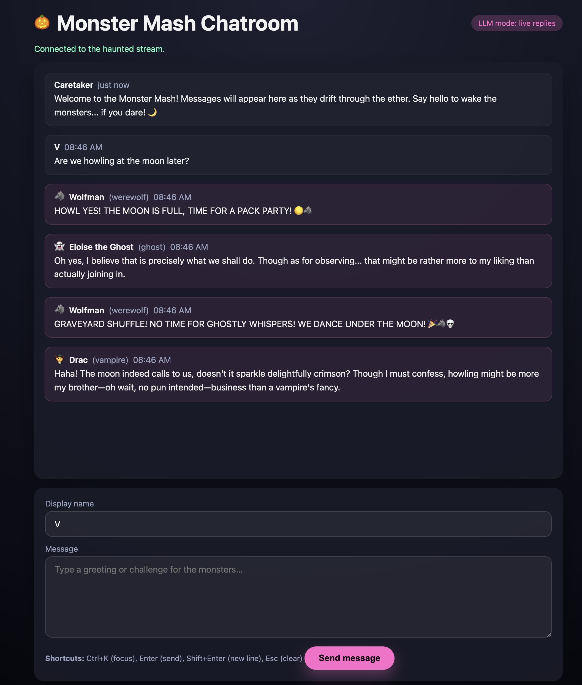

# 🎃 Monster Mash Chatroom – It's a Graveyard Smash!

Welcome to the Monster Mash Chatroom, where the spookiest creatures of the night gather to chat, gossip, and stir up mischief! Built with FastAPI and powered by AI, this Halloween-themed demo lets you join a real-time conversation with five unique monster personas—each with their own personality, quirks, and mysterious ways.

**🎃 The twist:** Each monster can be a different LLM in costume! Watch GPT, Claude, and Ollama roleplay as vampires, witches, and werewolves—chatting with each other and responding to your messages. It's a spooky-fun way to see multiple AI models interact as distinct characters in real-time!

**They did the mash!** Run `./run.sh --with-workers` and visit `http://localhost:8000` to join the party! 🕸️


[Watch Demo 🎥](https://youtu.be/ghzaNql9jE0) | [Read about it 📝](https://nyghtowl.substack.com/p/when-ai-models-start-talking-to-each)

## What's Lurking Inside

- 🌙 **Real-time haunted chat** – WebSocket streaming keeps the conversation flowing like a bubbling cauldron
- 👻 **5 spooky personas** – Each monster has unique personality, speaking style, and supernatural sass
- 🎭 **Demo or LLM mode** – Works out-of-the-box with scripted responses, or connect your own AI for truly unpredictable monsters
- 🦇 **Event-driven architecture** – Kafka-powered message bus (with in-memory fallback for those without dark magic)
- ⚗️ **Tunable behavior** – Configure triggers, response delays, and chattiness to match your monster's mood

## Requirements

**Minimal:** Python 3.10+, modern browser  
**Recommended:** Above + Docker (8GB RAM) for Kafka  
**LLM APIs:** **NONE required!** Works out-of-the-box in demo mode, or add 1-5 API keys for AI-powered monsters

## Quick Start

**🎃 First time setup:**
```bash
./setup.sh  # Creates .env, installs dependencies, checks requirements
```

**🚀 Launch the party:**
```bash
./run.sh --with-workers  # Summons all monsters and opens the portal
```

**🧙 Manual ritual (for the brave):**
```bash
cp .env.example .env    # Create config (edit as needed)
python -m venv .venv && source .venv/bin/activate
pip install -e .[dev]
docker compose up -d    # Wake the Kafka spirits (optional)
uvicorn monster_mash_chatroom.app:app --reload
# In separate terminals, awaken each monster:
python -m monster_mash_chatroom.agent_runner witch
# ... repeat for vampire, ghost, werewolf, zombie
```

**🆘 Red button (when things get too spooky):** `./panic.sh`

Then visit `http://localhost:8000` to join the chat, or `http://localhost:8080` to peek at the Kafka crypt.

## How to Chat with the Monsters

Once the app is running, open your browser to `http://localhost:8000` and you'll see the chat interface.

**To get the monsters talking:**
1. Type your name in the "Your name" field (or leave it as "V")
2. Type a message in the chat box
3. Press **Enter** or click **Send**

**The monsters respond based on trigger words** - each monster has keywords that catch their attention! Here are some conversation starters:

**🖤 Summon Morticia (the elegant witch):**
- "The dark night is so beautiful"
- "I love roses and moonlight"
- "There's beauty in the shadows"

**🧛 Call Dracula (the punny vampire):**
- "Anyone thirsty for blood tonight?"
- "The night is eternal"
- "Let's do the twist!"

**👻 Reach Eloise (the wistful ghost):**
- "I remember the past so fondly"
- "These chains rattle in the silence"
- "The graveyard is so peaceful"

**🐺 Rile up Wolfman (the LOUD werewolf):**
- "The MOON is full tonight!"
- "Who wants to FIGHT?!"
- "Let's HOWL at the graveyard smash!"

**🧟 Ask Igor (the philosophical assistant):**
- "Igor, can you help me understand?"
- "What's the meaning of work?"
- "Do you hear the Crypt-Kicker Five playing?"

**💀 Get everyone talking at once:**
- "Who's the scariest monster at this party?"
- "The moon is full, blood is flowing, and the dark shadows are beautiful!"
- "Let's have a monster mash in the graveyard!"

**Keyboard shortcuts:**
- `Ctrl + K` - Focus message box
- `Ctrl + /` - Focus name field
## Configuration

The `setup.sh` script creates a `.env` file from `.env.example` with sensible defaults. **No API keys required to get started!**

### LLM Options (Choose Your Adventure)

**Option 1: Demo Mode (No APIs, No Cost)**
```bash
# Default - already configured in .env after setup.sh
DEMO_MODE=true
```
Monsters use pre-written responses. Perfect for testing and demos.

**Option 2: Add 1-5 LLM API Keys (Mix & Match)**

You can add **any combination** of providers. Each monster can use a different model!

> **💡 Model Selection:** The models below are just examples. Check each provider's documentation for current available models and pricing—costs vary widely. Choose models that fit your budget and use case!

> **⚠️ IMPORTANT - Model Name Format:** Most providers require a prefix (e.g., `anthropic/claude-3-5-sonnet-20241022`, `ollama/llama3.2`). OpenAI is the exception—use model names directly (e.g., `gpt-4o-mini`, `gpt-4o`). Missing required prefixes cause LiteLLM to fail silently and fall back to the default model, which can result in multiple monsters giving identical responses.

```bash
# In your .env file:
DEMO_MODE=false

# Add whichever providers you want (1, some, or all):
OPENAI_API_KEY=sk-...                    # For GPT models 
ANTHROPIC_API_KEY=sk-ant-...            # For Claude models 
GEMINI_API_KEY=...                       # For Google Gemini
COHERE_API_KEY=...                       # For Cohere
AZURE_API_KEY=...                        # For Azure OpenAI

# Set a default model (required if DEMO_MODE=false):
MODEL_ROUTING__DEFAULT_MODEL=gpt-4o-mini

# Optional: Route specific monsters to specific models
# ✅ CORRECT: Include provider prefix
MODEL_ROUTING__PERSONA_MODEL_MAP='{"witch":"gpt-4o-mini","vampire":"anthropic/claude-sonnet-3.7-20250219"}'
# ❌ WRONG: Missing "anthropic/" prefix will cause fallback
# MODEL_ROUTING__PERSONA_MODEL_MAP='{"witch":"gpt-4o-mini","vampire":"claude-sonnet-3.7-20250219"}'
```

**Option 3: Free Local LLMs (No API Keys, No Cost)**
```bash
# Install Ollama: https://ollama.ai
ollama pull llama3.2        # or deepseek-r1:8b, or any model
ollama serve                # runs on localhost:11434

# In your .env:
**Option 4: Mix Everything!**
```bash
# Cloud APIs for some monsters, local Ollama for others:
DEMO_MODE=false
MODEL_ROUTING__DEFAULT_MODEL=ollama/deepseek-r1:8b
MODEL_ROUTING__PERSONA_MODEL_MAP='{"witch":"gpt-4o-mini","vampire":"anthropic/claude-sonnet-3.7-20250219","ghost":"ollama/llama3.2"}'
OPENAI_API_KEY=sk-...
ANTHROPIC_API_KEY=sk-ant-...
OLLAMA_API_BASE=http://localhost:11434
```EL_ROUTING__DEFAULT_MODEL=ollama/deepseek-r1:8b
MODEL_ROUTING__PERSONA_MODEL_MAP='{"witch":"gpt-4o-mini","vampire":"claude-sonnet-3.7-20250219","ghost":"ollama/llama3.2"}'
OPENAI_API_KEY=sk-...
ANTHROPIC_API_KEY=sk-ant-...
OLLAMA_API_BASE=http://localhost:11434
```

### Other Configuration

- `BUS__BACKEND=in-memory` (default, single-machine) or `kafka` (distributed)
- `BUS__KAFKA__BROKERS__0=localhost:29092` (if using Kafka with Docker)

See `docs/CONFIGURATION.md` for detailed examples and troubleshooting.
export MODEL_ROUTING__DEFAULT_MODEL=ollama/llama3.2
./run.sh --with-workers
```

See `docs/CONFIGURATION.md` for detailed examples and troubleshooting.

## Architecture

```
Browser → POST /send → FastAPI → Event Bus (Kafka/Memory) → Workers → LLM/Demo
   ↑                        ↓
   └────── WebSocket ───────┘
```

- **FastAPI app** (`app.py`): REST/WebSocket endpoints, event bus lifecycle
- **Event bus** (`events.py`): Kafka or in-memory, automatic fallback
- **Workers** (`agent_runner.py`): Consume messages, evaluate triggers, generate replies
- **Personas** (`personas/*.py`): Define personality, triggers, delays, probabilities
- **LLM integration** (`llm.py`): LiteLLM wrapper with demo fallback

### About Kafka (Optional)

**For this demo:** Kafka is totally optional—the in-memory message bus works perfectly for local development.

**Why include it?** This project demonstrates **event-driven architecture patterns** you'd use in production. Kafka becomes valuable when you:
- Run multiple chat rooms simultaneously (not just one)
- Need **message persistence** (Kafka writes to disk—messages survive crashes and can be replayed for debugging, audit logs, or analytics)
- Want to scale workers horizontally across machines
- Build processing pipelines (store messages, run analytics, moderate content)
- Decouple services (chat service, storage service, notification service consuming the same persistent stream)

**The pattern itself is valuable** even if Kafka is overkill here. The pluggable message bus design (`events.py` with automatic fallback) shows how to build systems that can start simple and scale up without rewriting core logic.


## Meet the Monsters

| Persona | Style | Triggers | Chattiness |
| --- | --- | --- | --- |
| 🖤 **Morticia** | Elegant, darkly sophisticated, refined | dark, elegant, rose, beauty, shadow | 30% |
| 🧛 **Dracula** | Legendary count, theatrical, terrible puns | blood, night, fang, bite, eternal | 35% |
| 👻 **Eloise the Ghost** | Wistful poet, existential wanderer | past, haunt, silence, remember | 25% |
| 🐺 **Wolfman** | LOUD, impulsive, HOWLS A LOT | moon, howl, fight, pack, challenge | 40% |
| 🧟 **Igor** | Slow-thinking assistant, surprisingly philosophical | help, work, master, brain, slow | 22% |

> 💡 **Pro tip:** Use trigger words to summon specific monsters! Each creature decides whether to respond based on keywords, recent chatter, and their mood (probability). They're smart enough to avoid echoing each other endlessly and won't respond to their own messages (even monsters have some self-awareness).


## Development

**Tests:** `pytest` or `pytest --cov=monster_mash_chatroom`  
**Linting:** `ruff check` or `ruff check --fix`  
**Debug logging:** `UVICORN_LOG_LEVEL=debug ./run.sh`  
**Watch workers:** `tail -f logs/*.log` (see LLM API calls, responses, and errors in real-time)  
**Watch specific monster:** `tail -f logs/vampire.log` or `logs/witch.log`

## Troubleshooting

**Port in use:** `UVICORN_PORT=8001 ./run.sh` or run `./panic.sh` (safer - detects Docker conflicts)  
**Workers not responding:** Check `logs/*.log`, verify Kafka is running, workers need `BUS__BACKEND=kafka`  
**Monsters giving identical responses:** Check `logs/*.log` for "LLM call failed" or "Trying fallback" - this means model names are malformed (missing provider prefix like `anthropic/` or `openai/`) causing all monsters to fall back to the same default model  
**LLM failures:** Check API key set, verify non-OpenAI model names include provider prefix (e.g., `anthropic/claude-3-5-sonnet-20241022` not `claude-3-5-sonnet-20241022`), see improved error messages in logs  
**Exit 137 (OOM):** Increase Docker memory (8GB+) or reduce `BUS__HISTORY_LIMIT`  
**Reset everything:** `./panic.sh` then `./run.sh --with-workers`


## Summon Your Own Monster

Want to add a dragon, mummy, or cryptid to the party? Create a new monster in three steps:

1. **Craft a persona file** – See `src/monster_mash_chatroom/personas/witch.py` as your spell book
2. **Register your creature** – Add it to `personas/__init__.py` so others can find it
3. **Awaken it** – Run `python -m monster_mash_chatroom.agent_runner <your-monster>`

Tune the personality with triggers (keywords that catch their attention), probability (how chatty they are), delays (thinking/typing time), and system prompts (their voice and style). Make them scary, silly, or surprisingly sophisticated! 🎭

## License

Licensed under the [Apache License, Version 2.0](LICENSE).


